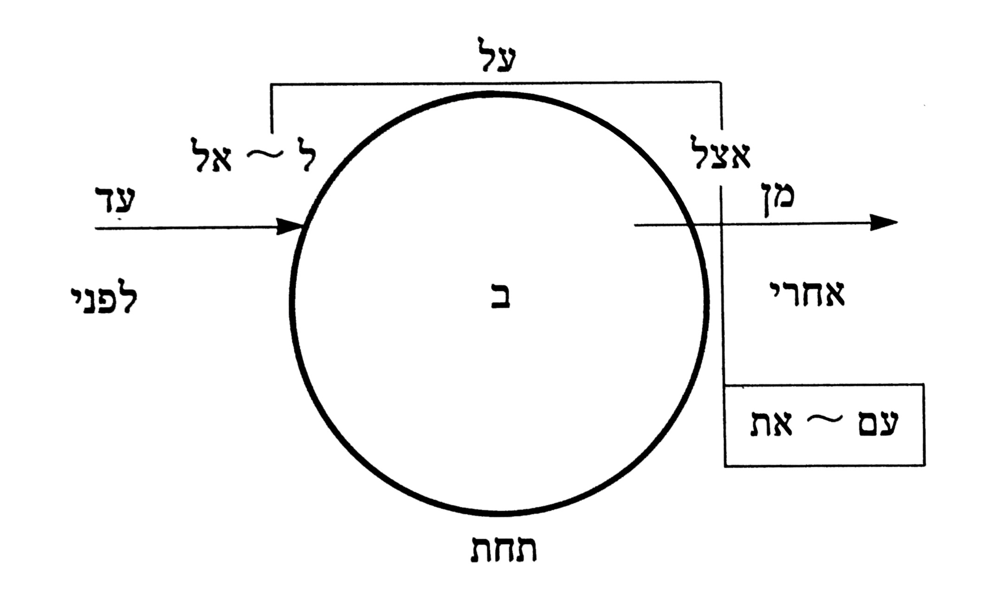

# Preposition Classes

Classes are made with regard to the hypothetical relationship of the preposition to its object.

>  
>  Waltke O'Connor 1990, 191.

Waltke O'Connor's preposition diagram shows the base meaning of prepositions in a locative sense. Adapting their diagram for temporal expressions, it is possible to extrapolate three general categories.

* internal - within the object ("during")
* behind_to - behind the object moving towards it ("before")
* after_from - after the object moving away from it ("after")

View [prep_annotations.tsv]('prep_annotations.tsv') to see which prepositions have been tagged with what category.

Compound prepositional statements will be viewed as extensions of these categories via their combination. Thus, compound prepositions will not be tagged separately. 

*TO DO: Run diagnostic tests to see whether the multiple prepositions reflected in my list are due to adnominal specifications. If so, they should be removed. Perhaps the compound prepositional phrases are separate Time phrases? I should also look at that. -2017-24-10*

# Substantive Classes

For the purpose of this work, the "substantive" is considered either the object of the preposition or a bare form that indicates the time at which a verb occurs. The term "substantive" is used broadly in the sense of "entity" to include adverbs.

Unfortunately, due to an oversight on my part, cardinal numbers are included in the export and should have been considered separately from other adverbs. They are ignored for the classifications.

Classes are built up gradually on a case by case basis. Classes that are blank will be disregarded.

* `unit` - a specific measurement of time (e.g. "day", "year")
* `subunit` - subgroups of units; times of day, seasons, etc. Perhaps not used for measuring time.
* `duration` - a duration of time
* `deictic_past` - the past relative to the time of speaking
* `deictic_present` - the present relative to time of speaking
* `deictic_future` - the future relative to time of speaking
* `event` - a noun version of a verb (e.g. "death"); can also include implied states (e.g. "youth" for "being young")
	* Perhaps events can be separated further into nouns based on verbs and nouns whose part of speech (not phrase dependent) is simply a substantive.

The following terms are more like prepositions themselves, and their "objects" will be needed for further analysis:

* `pos_start` - a position at the beginning of timeline
* `pos_end` - a position at end of timeline
* `pos_interior` - position interior: "within"
* `pos_posterior` - position posterior: "after"
* `pos_anterior` - position anterior: "before"

Other terms are more appropriately labeled as a demonstrative pronoun (in line with Waltke-O'Connor 307, 307n10):

* `demonstrative_far` - an adverb that points to something far
* `demonstrative_near` - an adverb that point to something near

The last class should probably be considered together with quantifiers:

* `collection` - describes the size of a group